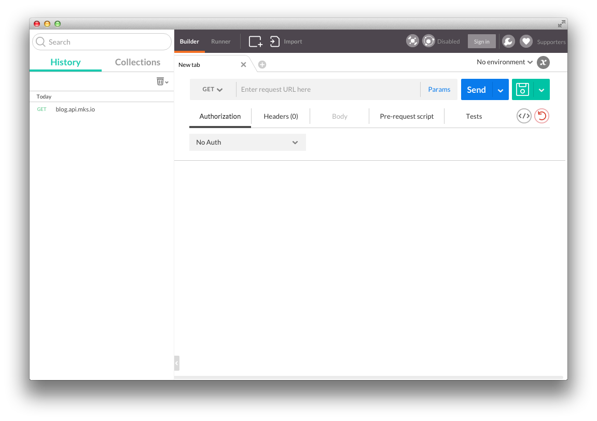
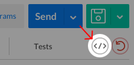

# Postman

[HTTP](http://library.makersquare.com/dictionary/http) is how computers communicate over the internet. [Postman](https://www.getpostman.com/docs) is a tool to make HTTP requests from the browser. It makes it very easy to test [HTTP APIs](http://library.makersquare.com/dictionary/http-api).

In this mini-sprint you will familiarize yourself with Postman, an excellent tool for trying, testing, and debugging HTTP requests. Specifically, you will:

- Install Postman
- Learn the difference between GET and POST requests
- Learn how to make GET and POST requests with Postman
- Interact with a toy API to get familiar with basic requests

## Getting Started

Install the [Postman](https://www.getpostman.com/) as a Chrome extension and [launch it](https://www.getpostman.com/docs/launch).

You should see something like this:



## What is an HTTP request?

At a high level, an HTTP request has two main parts: the **method** and **URL**.

Here are some examples, some of which we will explain more later:

```
GET     /blog-posts
POST    /blog-posts
GET     /blog-posts/1
PUT     /blog-posts/1
DELETE  /blog-posts/1
```

## My First GET Request

A GET request is essentially **asking** for data; we expect to receive some data in the **response body**.

Let's make a GET request. In the following area in Postman:


1. Type `http://blog.api.mks.io/` into the text box
2. Make sure the dropdown is set to `GET`
3. Click the Send button!

Woah! Did you see that? Something popped up! And it looks like [JSON](http://library.makersquare.com/dictionary/json)! No way!

## What just happened?

You just made an HTTP request to `http://blog.api.mks.io/`, one of our toy API servers. Let's inspect the details of this request.

Below the Send button, click the code snippet button:



You should see the following:

```
GET / HTTP/1.1
Host: blog.api.mks.io
Cache-Control: no-cache
Postman-Token: a9c36685-99da-d3e0-7493-837453ea2eb6
```

**KEY POINT:** This is the **HTTP request** that Postman made. In fact, it's **the full HTTP request in its entirety**. That's right. An HTTP request is *just a bunch of text*.

This specific request is requesting the root path (the slash `/` by itself is called the "root path") of the `blog.api.mks.io` domain, using HTTP version 1.1. Although there are different versions of HTTP, 1.1 is the only version you will work with for the foreseeable future.

The `Cache-Control: no-cache` header is telling the server to ignore any cache it may have of the content we are requesting. Usually you only want to do this during development.

The `Postman-Token:` header is something extra that Postman adds in. It's not part of the [official HTTP Specification](https://tools.ietf.org/html/rfc7231).

### The Response Body

Now let's inspect the response. You should already see something like the following:


As you can see, the response body looks like [JSON](http://library.makersquare.com/dictionary/json). However, it doesn't *actually* look like this; what you see is the "pretty" version, as indicated by the selected tab.

Click the `Raw` sub-tab. See the new view? It's the same data, but it it's no longer "pretty". Instead, it's the **raw response** the server actually gave Postman – a simple string. Although this string does in fact *represent* JSON, we can't *use* it as JSON until we parse it as such. For example, if we wanted to play with this data using JavaScript, we would need to run `JSON.parse`, which receives a string and returns an object.

## The Response Headers

Even though the body is the meat of the response, there is still one other section - the **response headers**.

Let's take a look at the response headers. To the right of the `Body` tab, click the `Headers` tab. You should see something like the following:

```
Access-Control-Allow-Headers: Origin, X-Requested-With, Content-Type, Accept
Access-Control-Allow-Methods: GET, POST, PUT, DELETE, OPTIONS
Access-Control-Allow-Origin: *
Connection: keep-alive
Content-Length: 42
Content-Type: application/json
Date: Mon, 10 Aug 2015 16:14:29 GMT
ETag: "1042442146"
Server: nginx/1.4.6 (Ubuntu)
X-Powered-By: Express
```

For now let's ignore all but the most important one: `Content-Type`. This header is the *server* telling the *client* (i.e. Postman) what **kind** of response body the server is sending. This is important because HTTP response bodies are always strings; it's up to the client (i.e. Postman) to parse the response body before using it.

Some example values of `Content-Type`:

- `application/json`
- `text/html`
- `text/css`

If `Content-Type` did not exist, Postman would basically have to **guess** at what kind of response body it is receiving.

## Exercise: Another GET Request

1. In Postman, make a GET request to `http://blog.api.mks.io/blog-posts`. What do you see?
2. Click the code snippet button to see the raw request. How does it differ from the first `GET` request you made?

## My First POST Request

As previously mentioned, a GET request only asks for data; it doesn't change any data on the server.

Contrast that with a POST request. A **POST request** is specifically *designed* to change data on the server. Not only that, but it also allows the client to send a **request body** (different from a response body), which is yet another string representing data.

Let's make a POST request in Postman:

1. Type `http://blog.api.mks.io/blog-posts` into the URL box
2. **Change the dropdown** by selecting POST instead of GET
3. Click the `Body` tab
4. Select the `raw` radio button
5. Enter the following JSON, replacing `{NAME}` with your first name:

```
{
  "title": "{NAME}'s first POST request",
  "content": "This is awesome!"
}
```

6) Click the blue `Send` button. You should see something like the following:


What's that? It didn't work! 400 is a [status code](http://www.w3.org/Protocols/rfc2616/rfc2616-sec10.html#sec10.4.1) - a special code that the server sends to the client, indicating the kind of response it is sending. In this case, the status codeis `400`, which means `Bad Request`. In other words, our request was no good, and the server says it cannot work with it.

Ok, so why didn't it work? To put it briefly, we need to set our `Content-Type` **request header**. Basically, we are sending a string that represents JSON, *but the server doesn't know that*. Howver, we can tell the server this fact by setting our `Content-Type` header to `application/json`.

### Headers

Let's add the aforementioned header:

1. Click the `Headers` tab to the left of the `Body` tab.
2. Enter `Content-Type` into the `Header` field
3. Enter `application/json` into the `Value` field
4. Try sending the request again.

Did it work? (check the status code). If your status code is `200`, that means everything went OK!

## What Just Happened®?

You just successfully sent a POST request, basically telling the server, "Hi server, I want to create a new blog post with this title and content. Thank you!" How did the server know we wanted to create a blog post? Simple - it inspected the **method** and **URL** (`POST` and `/blog-posts` respectively).

Let's first inspect the request itself. Once again, click the code snippet button. You should see something like the following:

```
POST /blog-posts HTTP/1.1
Host: blog.api.mks.io
Content-Type: application/json
Cache-Control: no-cache
Postman-Token: b4076c21-adb5-3f85-d8f0-e899036c4066

{
  "title": "Alice's first POST request",
  "content": "This is awesome!"
}
```

This is the raw request that you just made with Postman. It consists of **request headers** and a **request body**. Let's inspect the important parts:

- `POST /blog-posts` - this is the method and URL format. See it? Care for it. Memorize it. Love it. You will deal with this format for the rest of your programming career.

- `Content-Type` - You might be wondering, *haven't we already seen this?* Great catch – previously we saw it as a *response* header, but this time it's a *request* header. This tells the server how to interpret our request body.

- `{ "title": "Alice's first...` - And here we have the `request body` itself. This is text that we send to the server. This is the text that you typed into the `Body` tab.

## Conclusion and Recap

Learning HTTP is essential for *all* web developers. It's how the very internet works. In this lesson we covered:

- All HTTP requests have a **method** (GET, POST, etc.) and **URL**
- A POST request has a **request body**, while a GET request does not
- The `Content-Type` **header** informs the client or server how to interpret the request body
- The HTTP **status code** tells us if the request is ok or not:
  - A 200 status code means everything went OK
  - A 400 status code means there was an error on the client's side
  - A 500 status code means there was an error on the server's side (ok we didn't cover this but it's good to know)
  - Other status codes are [listed here](http://www.w3.org/Protocols/rfc2616/rfc2616-sec10.html)

Mastering HTTP will make the rest of your programming career much easier. Good luck!
